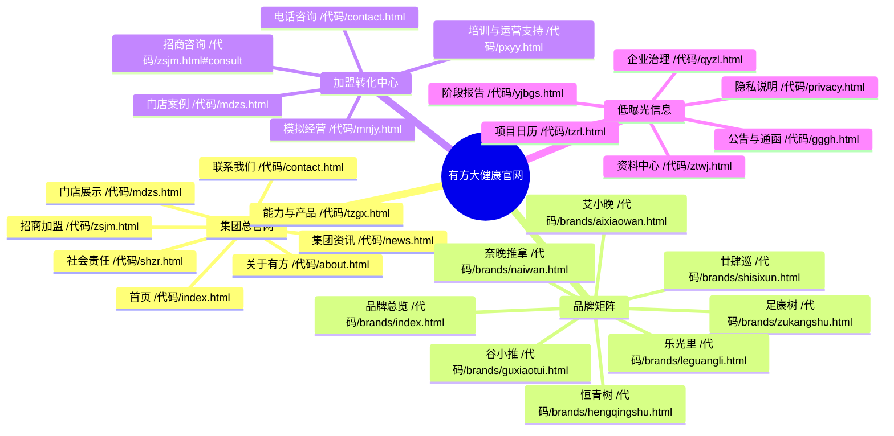
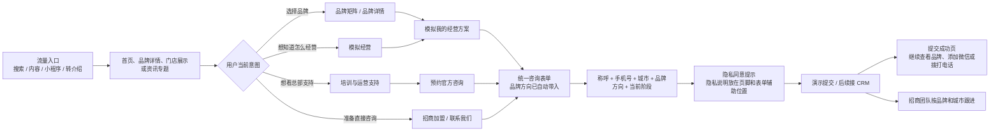

# 有方大健康官网

## 本轮产品约束

- 保留现有 8 项主导航、页面层级和视觉风格。
- 不新增“预算匹配器”，统一使用“模拟经营”。
- 不展示供应链、研发、工厂、冷链和采购模块；能力补充页只保留“培训与运营支持”。
- 不展示品牌授权关系和特许经营备案查询入口。
- 隐私说明不进入主导航，只放在页脚低调入口，并在表单提交处保留同意提示。
- 信息公开族页面（公告与通函、企业治理、项目日历、阶段报告、资料中心）同样不进主导航，统一挂在页脚“信息公开”低曝光入口。

## 页面补充清单

| 页面 | 路径 | 作用 |
| --- | --- | --- |
| 品牌矩阵 | `/代码/brands/index.html` | 集中展示 7 个品牌并分流到品牌详情 |
| 7 个品牌详情 | `/代码/brands/{brand}.html` | 每个品牌独立表达定位、适合场景、门店路径和支持方式 |
| 模拟经营 | `/代码/mnjy.html` | 用经营场景、角色和阶段生成一份模拟经营方案 |
| 培训与运营支持 | `/代码/pxyy.html` | 只展示开店培训、经营训练、日常协同和持续复盘 |
| 隐私说明 | `/代码/privacy.html` | 非主导航页面，仅作为页脚角落入口 |
| 信息公开族 × 5 | `/代码/{gggh,qyzl,tzrl,yjbgs,ztwj}.html` | 集团公告与治理类内容承载页，页脚“信息公开”入口 |

## 网站信息架构图（Mindmap）



## 页面跳转逻辑

```text
首页
├── 品牌卡片 → 品牌矩阵 / 品牌详情
├── 开始模拟经营 → 模拟经营
├── 数字化能力 → 能力与产品
├── 经营支持 → 培训与运营支持
├── 门店案例 → 门店展示
├── 观看品牌视频 → 首页视频弹层（品牌视频页另有集团资讯首条入口）
└── 官方咨询 → 招商加盟表单 / 联系我们

品牌矩阵
├── 7 个品牌卡片 → 对应品牌详情
└── 开始模拟经营 → 模拟经营

品牌详情
├── 了解门店场景 → 门店展示
├── 查看培训与运营支持 → 培训与运营支持
├── 模拟我的经营方案 → 模拟经营?brand={brand}
└── 预约官方咨询 → 招商加盟?brand={brand}#consult（表单自动带入品牌）

模拟经营
├── 选择经营场景、经营角色、当前阶段
├── 生成模拟经营方案
├── 查看招商 / 建店 / 运营任务
└── 提交官方咨询 → 招商加盟?brand={brand}#consult（表单自动带入品牌）

培训与运营支持
├── 开店前训练 → 招商 / 建店
├── 门店经营训练 → 运营
├── 持续协同 → 联系我们
└── 开始模拟经营 → 模拟经营

页脚（全站）
├── 信息公开 → 公告与通函 / 企业治理 / 项目日历 / 阶段报告 / 资料中心
└── 隐私说明 → privacy.html
```

品牌推荐口径统一：模拟经营的四种方案（`js/data.js` 的 `simPlans`）与模拟经营页“四种常见的经营思路”卡片使用同一套品牌分组——空间体验型=谷小推、乐光里；社区日常型=艾小晚、足康树；家庭与长者（照护）型=恒青树、奈晚推拿；城市生活型=廿肆巡。

## 高转化留资路径图



## 表单分层

### 统一咨询表单（zsjm.html 与 contact.html 字段一致）

- 称呼
- 手机号
- 所在城市
- 感兴趣的品牌方向
- 当前阶段：了解项目 / 正在看城市和位置 / 准备开店 / 已有门店，想优化经营
- 补充说明（选填）

### 模拟经营结果后的咨询

- 自动带入：当前品牌（`?brand=` 参数由 `data-consult-brand` 输入框消费，页面提示“已为你带入品牌方向”）
- 模拟场景、经营角色、当前阶段仍在模拟页内呈现，供沟通参考
- 用户只需补充：称呼、手机号、所在城市

### 线索质量判断

- 高意向：手机号、城市、品牌和当前阶段完整。
- 中意向：完成模拟经营，但尚未明确开店阶段。
- 培育型：只浏览品牌或门店内容，没有提交联系方式。

## 交付边界

本轮补充的是静态页面、页面跳转、模拟经营交互和演示表单路径。CRM、企业微信推送、正式资料包下载和正式隐私文本仍需业务系统与正式资料确认后接入。
